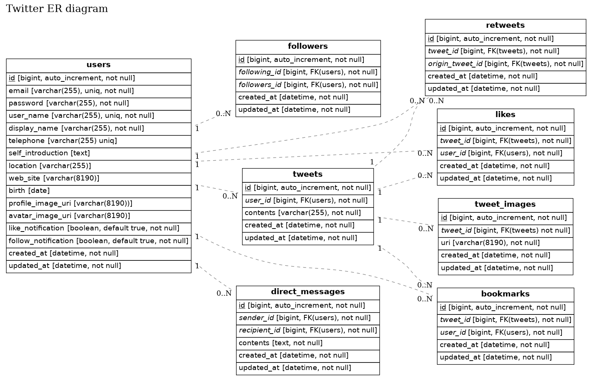

# Twitterのデータ構造をモデル化したものです

## 設計ポイント
- idはuuidを扱う
  - 分散を考慮。順序はcreated_atから取得
  - Postgresではuuid型を選択できるがMySQLでは選択できないためchar(36)とする
- 文字列
  - 基本的にvarchar(255)とする
  - uriはApacheが受け取れる制限の(8190)とする
  - tweet本文、自己紹介文、ダイレクトメッセージの文字制限は仕様変更を考慮してアプリケーション側で制限
- tweetにはimageを添付できる

## ER図

## 補足

- 
  |使用コマンド|効果|
  |--|--|
  |docker build . -t erd|docker build|
  |'docker run -i erd -f png < twitter.er > twitter.png'|png出力|